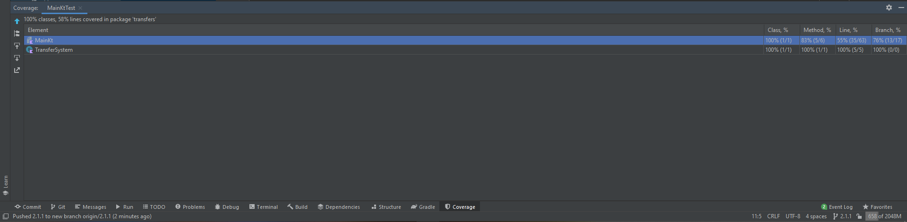

# 2.1.1 АВТОТЕСТЫ

У меня JaCoCo упорно не хотел запускаться, что я так и не смог пофиксить. По этой причине пришлось использовать coverage runner от Intellij IDEA (см. скриншот ниже).
Прошу не бросаться в меня тапками🥺🥺🥺

Кстати, не удалось достичь покрытия в 80 % — слишком большая main-функция.

